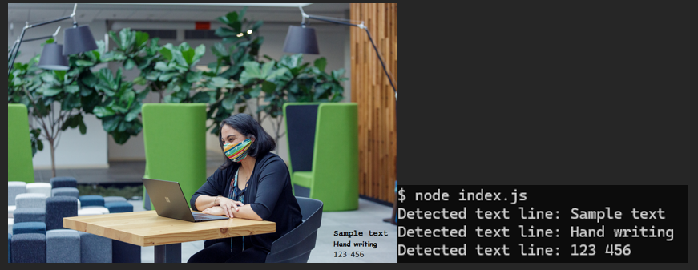
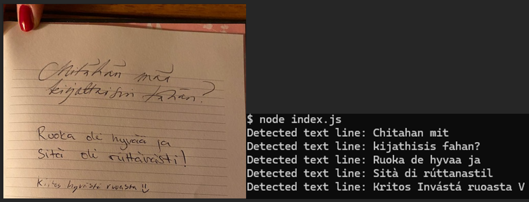

# Azure AI-vision analysis excercise

## About

Azure AI Vision Image Analysis computing written in JavaScript. My main goal was to test Azures Computer Visio ability to detect text from images. I used an image with some text written in common fonts and other image is handwritten text by three persons.

First result:

Second result:

## Instructions to success

1.	Sign up to Azure Portal
2.	Create Computer Vision resource
3.	Install Image Analysis client library for JavaScript
4.	Write code, add analyzing features and choose target image